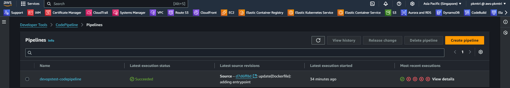
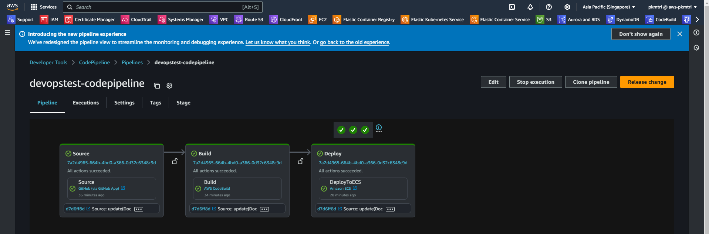
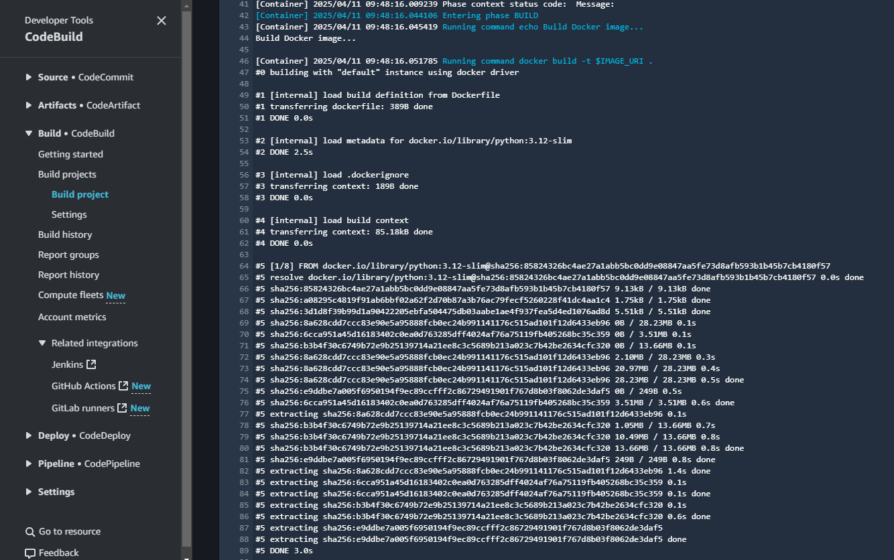
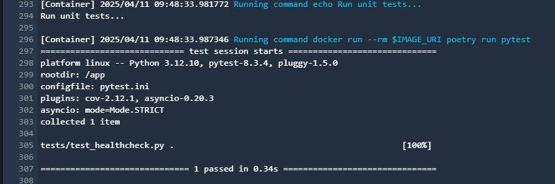
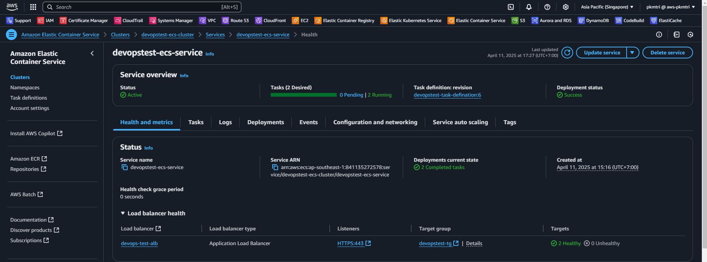
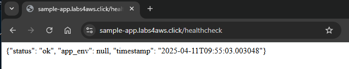

# DevOps Engineer Technical Assessment
Setting up a CI/CD pipeline to automate the build, test, and deployment of this application onto our existing infrastructure on AWS.

## Intro
Using terraform to create component services related to applications on AWS

Using Terraform to define the deployment pipeline for the application

## Install
Terraform v1.11.3 on linux_amd64

Registry.terraform.io/hashicorp/aws v5.94.1

Docker version 26.1.3

Docker Compose version v2.3.3

## Approach
- 1.Use docker compose to test the application locally and see the results

- 2.Tool selection: CodePipeline and CodeBuild meet the task of defining pipelines using IaC. Terraform makes IaC deployments fast and familiar

- 3.Using create define the deployment pipeline and component services related to applications on AWS by manual

- 4.Using terraform to create define the deployment pipeline and component services related to applications on AWS

## Result
- 1.terraform apply

- 2.pipeline

- 3.Logs and results
Build the application image

Test: Run unit tests

Deploy on ECS cluster

Final

[text](https://sample-app.labs4aws.click/healthcheck)